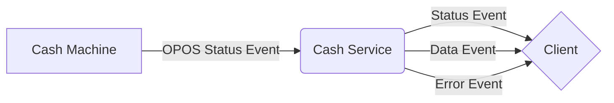
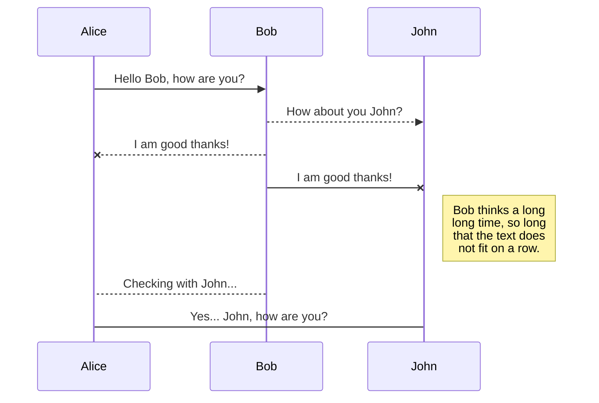
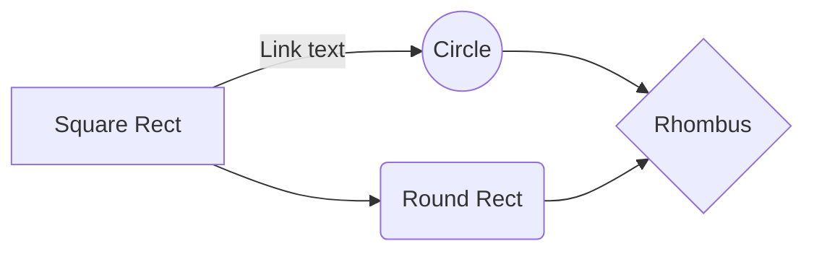

# Cash Service API
## Terms
* **Endpoint**: A uniquely addressable physical machine
* **Cash Machine**: An *endpoint* with cash devices capable of dispensing and accepting cash
* **Logical Device**: Refers to the logical OPOS device interfaces used to communicate with devices. [**Bill Acceptor/Coin Acceptor/Cash Changer**]  

## REST API
The REST API can be used to invoke operations on  the devices. As these operations can take anywhere from 1 second to a few minutes, operation responses are delivered asynchronously via [Operation Completion Events](#operation-completion-events)

## Session Handling
Sessions ensure control of a cash machine is restricted to one client at a time. The state of the current session is posted to the session channel as a retained message. If this topic has been cleared, no sessions are active for the machine.

```
Channel Type: public event (retained)
scox/v1/<retailer-id>/<store-id>/<endpoint-id>/cash/session/events
```

### Requesting a Session
If there are no sessions currently active for a machine, a new session can be started. The 

```
Channel Type: public event
scox/v1/<retailer-id>/<store-id>/<endpoint-id>/cash/session/requests
```

## Published Messages
Cash Service emits three categories of events:

 - Operation Completion Events
 - External Error Events 
 - External Status Events
 - External Data Events

### Operation Completion Events
Operation completion events signify the result of  a requested device operation. These are emitted as direct responses to an incoming command event. Responses are correlated with their associated command using the message ID provided in the request.

```
Channel Type: private request respones
scox/v1/<retailer-id>/<store-id>/<endpoint-id>/cash/<operation>/requests/<message-id>
```

These messages provide an ```error``` field containing the device error details required to lookup an error code. Read more at: [error handling](#error-handling)

The payload of these messages may contain additional information specific to the type of operation request (e.g. cash counts dispensed / inventory counts / etc)

### External Error Events
External error events notify subscribers of failure events which transition the cash machine into an error state. These errors are often triggered by physical changes to the machine such as removing the notebox or a coin/note jam. Physical intervention is usually required to remedy these issues.

**Note:** Operations issued to a cash machine that is in an error state will always fail

These messages provide an ```error``` field containing the device error details required to lookup an error code. Read more at: [error handling](#error-handling)

```
Channel Type: public events (retained)
scox/v1/<retailer-id>/<store-id>/<endpoint-id>/cash/error/events
```

### External Status Events
External status events notify subscribers of persistent physical changes to the machine that do not place the machine in an error state. As these messages reflect a persistent change to state, they are *retained* on the broker. An example of these events might include devices' inventory reaching near-capacity or dropping below the configured low level.

Status Channel:
```
Channel Type: public events (retained)
scox/v1/<retailer-id>/<store-id>/<endpoint-id>/cash/status/<sub-domain>/events
```

### External Data Events
External data events notify subscribers of transient actions performed against the machine. These message are not retained. An example of these events may include reinserting the notebox or depositing a coin / note.

Data Channels: 
```
Channel Type: public events
scox/v1/<retailer-id>/<store-id>/<endpoint-id>/cash/<sub-domain>/events
```

## Error Handling

When Cash Service receives an OPOS status event from a machine, Cash Service must determine whether the event is an error or not. If the status event received is a non-error, it may be emitted over the [status channel](#external-status-events) or [data channel](#external-data-events).

If a status event is deemed to require manual intervention, it will be reported on the errors channel. This channel is retained and will contain the *last* error received from any logical device. **Further device operations will not be accepted until this issue is resolved.** When the Self-Test operation is invoked, this topic will be cleared. Status events resulting from the Self-Test may repopulate this channel if the issue was not resolved or another issue arises.


[![](https://mermaid.ink/img/eyJjb2RlIjoiZ3JhcGggTFJcbkRTW0Nhc2ggTWFjaGluZV0gLS0gT1BPUyBTdGF0dXMgRXZlbnQgLS0-IENTKENhc2ggU2VydmljZSlcbkNTIC0tIFN0YXR1cyBFdmVudCAgLS0-IENMSXtDbGllbnR9XG5DUyAtLSBEYXRhIEV2ZW50IC0tPiBDTElcbkNTIC0tIEVycm9yIEV2ZW50IC0tPiBDTEkiLCJtZXJtYWlkIjp7InRoZW1lIjoiZGVmYXVsdCIsInRoZW1lVmFyaWFibGVzIjp7ImJhY2tncm91bmQiOiJ3aGl0ZSIsInByaW1hcnlDb2xvciI6IiNFQ0VDRkYiLCJzZWNvbmRhcnlDb2xvciI6IiNmZmZmZGUiLCJ0ZXJ0aWFyeUNvbG9yIjoiaHNsKDgwLCAxMDAlLCA5Ni4yNzQ1MDk4MDM5JSkiLCJwcmltYXJ5Qm9yZGVyQ29sb3IiOiJoc2woMjQwLCA2MCUsIDg2LjI3NDUwOTgwMzklKSIsInNlY29uZGFyeUJvcmRlckNvbG9yIjoiaHNsKDYwLCA2MCUsIDgzLjUyOTQxMTc2NDclKSIsInRlcnRpYXJ5Qm9yZGVyQ29sb3IiOiJoc2woODAsIDYwJSwgODYuMjc0NTA5ODAzOSUpIiwicHJpbWFyeVRleHRDb2xvciI6IiMxMzEzMDAiLCJzZWNvbmRhcnlUZXh0Q29sb3IiOiIjMDAwMDIxIiwidGVydGlhcnlUZXh0Q29sb3IiOiJyZ2IoOS41MDAwMDAwMDAxLCA5LjUwMDAwMDAwMDEsIDkuNTAwMDAwMDAwMSkiLCJsaW5lQ29sb3IiOiIjMzMzMzMzIiwidGV4dENvbG9yIjoiIzMzMyIsIm1haW5Ca2ciOiIjRUNFQ0ZGIiwic2Vjb25kQmtnIjoiI2ZmZmZkZSIsImJvcmRlcjEiOiIjOTM3MERCIiwiYm9yZGVyMiI6IiNhYWFhMzMiLCJhcnJvd2hlYWRDb2xvciI6IiMzMzMzMzMiLCJmb250RmFtaWx5IjoiXCJ0cmVidWNoZXQgbXNcIiwgdmVyZGFuYSwgYXJpYWwiLCJmb250U2l6ZSI6IjE2cHgiLCJsYWJlbEJhY2tncm91bmQiOiIjZThlOGU4Iiwibm9kZUJrZyI6IiNFQ0VDRkYiLCJub2RlQm9yZGVyIjoiIzkzNzBEQiIsImNsdXN0ZXJCa2ciOiIjZmZmZmRlIiwiY2x1c3RlckJvcmRlciI6IiNhYWFhMzMiLCJkZWZhdWx0TGlua0NvbG9yIjoiIzMzMzMzMyIsInRpdGxlQ29sb3IiOiIjMzMzIiwiZWRnZUxhYmVsQmFja2dyb3VuZCI6IiNlOGU4ZTgiLCJhY3RvckJvcmRlciI6ImhzbCgyNTkuNjI2MTY4MjI0MywgNTkuNzc2NTM2MzEyOCUsIDg3LjkwMTk2MDc4NDMlKSIsImFjdG9yQmtnIjoiI0VDRUNGRiIsImFjdG9yVGV4dENvbG9yIjoiYmxhY2siLCJhY3RvckxpbmVDb2xvciI6ImdyZXkiLCJzaWduYWxDb2xvciI6IiMzMzMiLCJzaWduYWxUZXh0Q29sb3IiOiIjMzMzIiwibGFiZWxCb3hCa2dDb2xvciI6IiNFQ0VDRkYiLCJsYWJlbEJveEJvcmRlckNvbG9yIjoiaHNsKDI1OS42MjYxNjgyMjQzLCA1OS43NzY1MzYzMTI4JSwgODcuOTAxOTYwNzg0MyUpIiwibGFiZWxUZXh0Q29sb3IiOiJibGFjayIsImxvb3BUZXh0Q29sb3IiOiJibGFjayIsIm5vdGVCb3JkZXJDb2xvciI6IiNhYWFhMzMiLCJub3RlQmtnQ29sb3IiOiIjZmZmNWFkIiwibm90ZVRleHRDb2xvciI6ImJsYWNrIiwiYWN0aXZhdGlvbkJvcmRlckNvbG9yIjoiIzY2NiIsImFjdGl2YXRpb25Ca2dDb2xvciI6IiNmNGY0ZjQiLCJzZXF1ZW5jZU51bWJlckNvbG9yIjoid2hpdGUiLCJzZWN0aW9uQmtnQ29sb3IiOiJyZ2JhKDEwMiwgMTAyLCAyNTUsIDAuNDkpIiwiYWx0U2VjdGlvbkJrZ0NvbG9yIjoid2hpdGUiLCJzZWN0aW9uQmtnQ29sb3IyIjoiI2ZmZjQwMCIsInRhc2tCb3JkZXJDb2xvciI6IiM1MzRmYmMiLCJ0YXNrQmtnQ29sb3IiOiIjOGE5MGRkIiwidGFza1RleHRMaWdodENvbG9yIjoid2hpdGUiLCJ0YXNrVGV4dENvbG9yIjoid2hpdGUiLCJ0YXNrVGV4dERhcmtDb2xvciI6ImJsYWNrIiwidGFza1RleHRPdXRzaWRlQ29sb3IiOiJibGFjayIsInRhc2tUZXh0Q2xpY2thYmxlQ29sb3IiOiIjMDAzMTYzIiwiYWN0aXZlVGFza0JvcmRlckNvbG9yIjoiIzUzNGZiYyIsImFjdGl2ZVRhc2tCa2dDb2xvciI6IiNiZmM3ZmYiLCJncmlkQ29sb3IiOiJsaWdodGdyZXkiLCJkb25lVGFza0JrZ0NvbG9yIjoibGlnaHRncmV5IiwiZG9uZVRhc2tCb3JkZXJDb2xvciI6ImdyZXkiLCJjcml0Qm9yZGVyQ29sb3IiOiIjZmY4ODg4IiwiY3JpdEJrZ0NvbG9yIjoicmVkIiwidG9kYXlMaW5lQ29sb3IiOiJyZWQiLCJsYWJlbENvbG9yIjoiYmxhY2siLCJlcnJvckJrZ0NvbG9yIjoiIzU1MjIyMiIsImVycm9yVGV4dENvbG9yIjoiIzU1MjIyMiIsImNsYXNzVGV4dCI6IiMxMzEzMDAiLCJmaWxsVHlwZTAiOiIjRUNFQ0ZGIiwiZmlsbFR5cGUxIjoiI2ZmZmZkZSIsImZpbGxUeXBlMiI6ImhzbCgzMDQsIDEwMCUsIDk2LjI3NDUwOTgwMzklKSIsImZpbGxUeXBlMyI6ImhzbCgxMjQsIDEwMCUsIDkzLjUyOTQxMTc2NDclKSIsImZpbGxUeXBlNCI6ImhzbCgxNzYsIDEwMCUsIDk2LjI3NDUwOTgwMzklKSIsImZpbGxUeXBlNSI6ImhzbCgtNCwgMTAwJSwgOTMuNTI5NDExNzY0NyUpIiwiZmlsbFR5cGU2IjoiaHNsKDgsIDEwMCUsIDk2LjI3NDUwOTgwMzklKSIsImZpbGxUeXBlNyI6ImhzbCgxODgsIDEwMCUsIDkzLjUyOTQxMTc2NDclKSJ9fSwidXBkYXRlRWRpdG9yIjpmYWxzZX0)](https://mermaid-js.github.io/mermaid-live-editor/#/edit/eyJjb2RlIjoiZ3JhcGggTFJcbkRTW0Nhc2ggTWFjaGluZV0gLS0gT1BPUyBTdGF0dXMgRXZlbnQgLS0-IENTKENhc2ggU2VydmljZSlcbkNTIC0tIFN0YXR1cyBFdmVudCAgLS0-IENMSXtDbGllbnR9XG5DUyAtLSBEYXRhIEV2ZW50IC0tPiBDTElcbkNTIC0tIEVycm9yIEV2ZW50IC0tPiBDTEkiLCJtZXJtYWlkIjp7InRoZW1lIjoiZGVmYXVsdCIsInRoZW1lVmFyaWFibGVzIjp7ImJhY2tncm91bmQiOiJ3aGl0ZSIsInByaW1hcnlDb2xvciI6IiNFQ0VDRkYiLCJzZWNvbmRhcnlDb2xvciI6IiNmZmZmZGUiLCJ0ZXJ0aWFyeUNvbG9yIjoiaHNsKDgwLCAxMDAlLCA5Ni4yNzQ1MDk4MDM5JSkiLCJwcmltYXJ5Qm9yZGVyQ29sb3IiOiJoc2woMjQwLCA2MCUsIDg2LjI3NDUwOTgwMzklKSIsInNlY29uZGFyeUJvcmRlckNvbG9yIjoiaHNsKDYwLCA2MCUsIDgzLjUyOTQxMTc2NDclKSIsInRlcnRpYXJ5Qm9yZGVyQ29sb3IiOiJoc2woODAsIDYwJSwgODYuMjc0NTA5ODAzOSUpIiwicHJpbWFyeVRleHRDb2xvciI6IiMxMzEzMDAiLCJzZWNvbmRhcnlUZXh0Q29sb3IiOiIjMDAwMDIxIiwidGVydGlhcnlUZXh0Q29sb3IiOiJyZ2IoOS41MDAwMDAwMDAxLCA5LjUwMDAwMDAwMDEsIDkuNTAwMDAwMDAwMSkiLCJsaW5lQ29sb3IiOiIjMzMzMzMzIiwidGV4dENvbG9yIjoiIzMzMyIsIm1haW5Ca2ciOiIjRUNFQ0ZGIiwic2Vjb25kQmtnIjoiI2ZmZmZkZSIsImJvcmRlcjEiOiIjOTM3MERCIiwiYm9yZGVyMiI6IiNhYWFhMzMiLCJhcnJvd2hlYWRDb2xvciI6IiMzMzMzMzMiLCJmb250RmFtaWx5IjoiXCJ0cmVidWNoZXQgbXNcIiwgdmVyZGFuYSwgYXJpYWwiLCJmb250U2l6ZSI6IjE2cHgiLCJsYWJlbEJhY2tncm91bmQiOiIjZThlOGU4Iiwibm9kZUJrZyI6IiNFQ0VDRkYiLCJub2RlQm9yZGVyIjoiIzkzNzBEQiIsImNsdXN0ZXJCa2ciOiIjZmZmZmRlIiwiY2x1c3RlckJvcmRlciI6IiNhYWFhMzMiLCJkZWZhdWx0TGlua0NvbG9yIjoiIzMzMzMzMyIsInRpdGxlQ29sb3IiOiIjMzMzIiwiZWRnZUxhYmVsQmFja2dyb3VuZCI6IiNlOGU4ZTgiLCJhY3RvckJvcmRlciI6ImhzbCgyNTkuNjI2MTY4MjI0MywgNTkuNzc2NTM2MzEyOCUsIDg3LjkwMTk2MDc4NDMlKSIsImFjdG9yQmtnIjoiI0VDRUNGRiIsImFjdG9yVGV4dENvbG9yIjoiYmxhY2siLCJhY3RvckxpbmVDb2xvciI6ImdyZXkiLCJzaWduYWxDb2xvciI6IiMzMzMiLCJzaWduYWxUZXh0Q29sb3IiOiIjMzMzIiwibGFiZWxCb3hCa2dDb2xvciI6IiNFQ0VDRkYiLCJsYWJlbEJveEJvcmRlckNvbG9yIjoiaHNsKDI1OS42MjYxNjgyMjQzLCA1OS43NzY1MzYzMTI4JSwgODcuOTAxOTYwNzg0MyUpIiwibGFiZWxUZXh0Q29sb3IiOiJibGFjayIsImxvb3BUZXh0Q29sb3IiOiJibGFjayIsIm5vdGVCb3JkZXJDb2xvciI6IiNhYWFhMzMiLCJub3RlQmtnQ29sb3IiOiIjZmZmNWFkIiwibm90ZVRleHRDb2xvciI6ImJsYWNrIiwiYWN0aXZhdGlvbkJvcmRlckNvbG9yIjoiIzY2NiIsImFjdGl2YXRpb25Ca2dDb2xvciI6IiNmNGY0ZjQiLCJzZXF1ZW5jZU51bWJlckNvbG9yIjoid2hpdGUiLCJzZWN0aW9uQmtnQ29sb3IiOiJyZ2JhKDEwMiwgMTAyLCAyNTUsIDAuNDkpIiwiYWx0U2VjdGlvbkJrZ0NvbG9yIjoid2hpdGUiLCJzZWN0aW9uQmtnQ29sb3IyIjoiI2ZmZjQwMCIsInRhc2tCb3JkZXJDb2xvciI6IiM1MzRmYmMiLCJ0YXNrQmtnQ29sb3IiOiIjOGE5MGRkIiwidGFza1RleHRMaWdodENvbG9yIjoid2hpdGUiLCJ0YXNrVGV4dENvbG9yIjoid2hpdGUiLCJ0YXNrVGV4dERhcmtDb2xvciI6ImJsYWNrIiwidGFza1RleHRPdXRzaWRlQ29sb3IiOiJibGFjayIsInRhc2tUZXh0Q2xpY2thYmxlQ29sb3IiOiIjMDAzMTYzIiwiYWN0aXZlVGFza0JvcmRlckNvbG9yIjoiIzUzNGZiYyIsImFjdGl2ZVRhc2tCa2dDb2xvciI6IiNiZmM3ZmYiLCJncmlkQ29sb3IiOiJsaWdodGdyZXkiLCJkb25lVGFza0JrZ0NvbG9yIjoibGlnaHRncmV5IiwiZG9uZVRhc2tCb3JkZXJDb2xvciI6ImdyZXkiLCJjcml0Qm9yZGVyQ29sb3IiOiIjZmY4ODg4IiwiY3JpdEJrZ0NvbG9yIjoicmVkIiwidG9kYXlMaW5lQ29sb3IiOiJyZWQiLCJsYWJlbENvbG9yIjoiYmxhY2siLCJlcnJvckJrZ0NvbG9yIjoiIzU1MjIyMiIsImVycm9yVGV4dENvbG9yIjoiIzU1MjIyMiIsImNsYXNzVGV4dCI6IiMxMzEzMDAiLCJmaWxsVHlwZTAiOiIjRUNFQ0ZGIiwiZmlsbFR5cGUxIjoiI2ZmZmZkZSIsImZpbGxUeXBlMiI6ImhzbCgzMDQsIDEwMCUsIDk2LjI3NDUwOTgwMzklKSIsImZpbGxUeXBlMyI6ImhzbCgxMjQsIDEwMCUsIDkzLjUyOTQxMTc2NDclKSIsImZpbGxUeXBlNCI6ImhzbCgxNzYsIDEwMCUsIDk2LjI3NDUwOTgwMzklKSIsImZpbGxUeXBlNSI6ImhzbCgtNCwgMTAwJSwgOTMuNTI5NDExNzY0NyUpIiwiZmlsbFR5cGU2IjoiaHNsKDgsIDEwMCUsIDk2LjI3NDUwOTgwMzklKSIsImZpbGxUeXBlNyI6ImhzbCgxODgsIDEwMCUsIDkzLjUyOTQxMTc2NDclKSJ9fSwidXBkYXRlRWRpdG9yIjpmYWxzZX0)
> **Open Questions:**
> * Should this be broken down /w subdomains for retained warnings?
> (e.g. NEARFULL) 
>  * Persistent warnings may be per-device (both cash
> acceptor & coin acceptor could report nearfull). How do we support
> this?
>  * Should both internal & external Self-Tests clear the error channel?

## UML diagrams

You can render UML diagrams using [Mermaid](https://mermaidjs.github.io/). For example, this will produce a sequence diagram:



And this will produce a flow chart:


